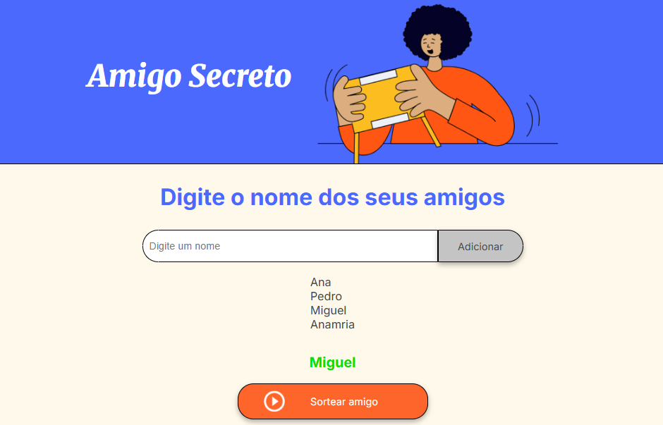

# Desafio One Oracle - Sorteador de Nomes

## Descrição do projeto 
<p align="justify">
  Este projeto é um desafio de lógica de programação lançado pela One Oracle + Alura. O objetivo é fazer um sorteador de nomes para Amigo Secreto.
</p>

## Funcionalidades

:heavy_check_mark: Adicionar os nomes dos amigos em uma lista;

:heavy_check_mark: Validação para garantir que a lista não esteja com elementos vazios;

:heavy_check_mark: Exibir os nomes que foram adicionados;

:heavy_check_mark: Sortear os nomes;

:heavy_check_mark: Validação para que os nomes que já foram sorteados não sejam repetidos;

:heavy_check_mark: Permitir que o nome sorteado seja removido da tela para manter o sigilo.

## Layout



## Pré-requisitos

Para executar este projeto, você precisa de:

- Um navegador web atualizado (Google Chrome, Firefox, Edge, Safari etc.)
- Editor de código (opcional, mas recomendado: [Visual Studio Code](https://code.visualstudio.com/))
- Git instalado (opcional, caso queira clonar o repositório) – [Baixar Git](https://git-scm.com/)

## Como rodar a aplicação :arrow_forward:

No terminal, clone o projeto: 

```
git clone https://github.com/JaideneMaria/DesafioOneOracle-challenge-amigo-secreto.git
``` 
## Linguagens utilizadas :books:

- JavaScript
- HTML
- CSS
